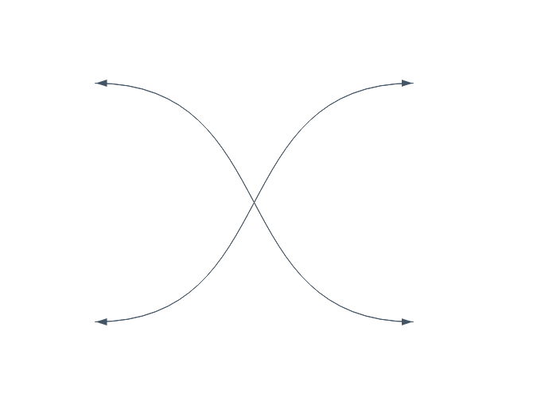
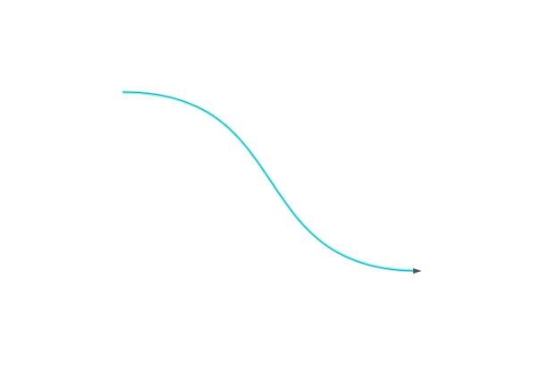
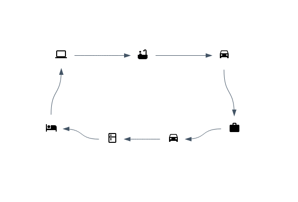

# react-simple-arrows

[](https://npmjs.org/package/react-simple-arrows)
[](https://npmjs.org/package/react-simple-arrows)
[](https://github.com/uladkasach/react-simple-arrows/blob/master/package.json)

react components which make it simple to create svg arrows in a react app

# usage

## ArrowSvg

The `ArrowSvg` component will create a svg component bounding the start and end points you specify and use svg paths to draw the arrow on the svg plane which goes from the "start" position and to the "end" position. The svg is positioned absolutely (`position: 'absolute'`).

#### example:



is produced by:

```tsx
  <ArrowSvg start={{ x: 200, y: 300 }} end={{ x: 600, y: 600 }} orientation={LineOrientation.HORIZONTAL} />
  <ArrowSvg start={{ x: 600, y: 300 }} end={{ x: 200, y: 600 }} orientation={LineOrientation.HORIZONTAL} />
  <ArrowSvg start={{ x: 200, y: 600 }} end={{ x: 600, y: 300 }} orientation={LineOrientation.HORIZONTAL} />
  <ArrowSvg start={{ x: 600, y: 600 }} end={{ x: 200, y: 300 }} orientation={LineOrientation.HORIZONTAL} />
```

Highlighting can be added using the `highlight` and `highlightColor` attributes (where `highlightColor` is any CSS-recognised color name, defaulting to pink if none is specified).

#### example



is produced by:

```tsx
  <ArrowSvg start={{ x: 0, y: 0 }} end={{ x: 500, y: 300 }} orientation={LineOrientation.HORIZONTAL} highlight={true} highlightColor="cyan" />
```

## ArrowBetweenDivs

The `ArrowBetweenDivs` component will keep track of the coordinates of registered divs on the page, so that you can create arrows between them by name (i.e., the `id`). Tracking the coordinates of the divs on the page is handled by the `ArrowsBetweenDivsContextProvider`.

#### example:



is produced by

```tsx
  import { Bathtub, DriveEta, Work, Hotel, Computer, Kitchen } from '@material-ui/icons';

  // ...

  <ArrowsBetweenDivsContextProvider debug>
    {({ registerDivToArrowsContext }) => (
      <>
        {/* the arrows can be placed anywhere, as they position themselves absolutely and will wait to display until coordinates are registered */}
        <ArrowBetweenDivs
          from={{ id: 'sleep', placement: ArrowAnchorPlacement.TOP }}
          to={{ id: 'code', placement: ArrowAnchorPlacement.BOTTOM }}
          orientation={LineOrientation.VERTICAL}
        />
        <ArrowBetweenDivs
          from={{ id: 'code', placement: ArrowAnchorPlacement.RIGHT }}
          to={{ id: 'shower', placement: ArrowAnchorPlacement.LEFT }}
          orientation={LineOrientation.HORIZONTAL}
        />
        <ArrowBetweenDivs
          from={{ id: 'shower', placement: ArrowAnchorPlacement.RIGHT }}
          to={{ id: 'driveToWork', placement: ArrowAnchorPlacement.LEFT }}
          orientation={LineOrientation.HORIZONTAL}
        />
        <ArrowBetweenDivs
          from={{ id: 'driveToWork', placement: ArrowAnchorPlacement.BOTTOM }}
          to={{ id: 'work', placement: ArrowAnchorPlacement.TOP }}
          orientation={LineOrientation.VERTICAL}
        />
        <ArrowBetweenDivs
          from={{ id: 'work', placement: ArrowAnchorPlacement.LEFT }}
          to={{ id: 'driveFromWork', placement: ArrowAnchorPlacement.RIGHT }}
          orientation={LineOrientation.HORIZONTAL}
        />
        <ArrowBetweenDivs
          from={{ id: 'driveFromWork', placement: ArrowAnchorPlacement.LEFT }}
          to={{ id: 'eat', placement: ArrowAnchorPlacement.RIGHT }}
          orientation={LineOrientation.HORIZONTAL}
        />
        <ArrowBetweenDivs
          from={{ id: 'eat', placement: ArrowAnchorPlacement.LEFT }}
          to={{ id: 'sleep', placement: ArrowAnchorPlacement.RIGHT }}
          orientation={LineOrientation.HORIZONTAL}
        />

        {/* define your content and register each one of the divs by "id" into the context by ref */}
        <div style={{ display: 'flex', justifyContent: 'space-between', width: 500, height: 300, flexDirection: 'column' }}>
          <div style={{ display: 'flex', justifyContent: 'space-around', flex: 1 }}>
            <div>
              <div ref={(div) => registerDivToArrowsContext({ id: 'code', div })} style={{ padding: 15 }}>
                <Computer />
              </div>
            </div>
            <div>
              <div ref={(div) => registerDivToArrowsContext({ id: 'shower', div })} style={{ padding: 15 }}>
                <Bathtub />
              </div>
            </div>
            <div>
              <div ref={(div) => registerDivToArrowsContext({ id: 'driveToWork', div })} style={{ padding: 15 }}>
                <DriveEta />
              </div>
            </div>
          </div>
          <div style={{ display: 'flex', justifyContent: 'space-around', flex: 1 }}>
            <div>
              <div ref={(div) => registerDivToArrowsContext({ id: 'sleep', div })} style={{ padding: 15 }}>
                <Hotel />
              </div>
            </div>
            <div style={{ marginTop: 21 }}>
              <div ref={(div) => registerDivToArrowsContext({ id: 'eat', div })} style={{ padding: 15 }}>
                <Kitchen />
              </div>
            </div>
            <div style={{ marginTop: 21 }}>
              <div ref={(div) => registerDivToArrowsContext({ id: 'driveFromWork', div })} style={{ padding: 15 }}>
                <DriveEta />
              </div>
            </div>
            <div>
              <div ref={(div) => registerDivToArrowsContext({ id: 'work', div })} style={{ padding: 15 }}>
                <Work />
              </div>
            </div>
          </div>
        </div>
      </>
    )}
  </ArrowsBetweenDivsContextProvider>
```


